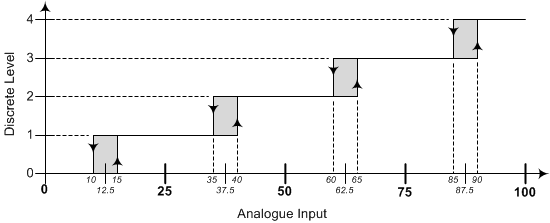

# encoder_hyst
This project is a pesudo algorithm for handling hysteresis ADC Encoder  


# Dependencies
The code was tested on Ubuntu 18.04.4
```bash
sudo apt-get install build-essential make g++
```
# Testing
in Order to run the executable just
```
./src/encoder.run
```

The Code Output
```
Building the project.............
-----Running-----
Last Input: 0  Current Input: 5  Level: 0
Last Input: 5  Current Input: 45 Level: 2
Last Input: 45 Current Input: 36 Level: 2
Last Input: 36 Current Input: 0  Level: 0
Last Input: 0  Current Input: 0  Level: 0

```

To build the project

```
make build
```
To build and run the project 

```
make run
```

to clean the executable 

```
make clean
```



